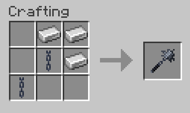

# Flails !!

hello! this is a mod that adds... flails !! (actually just a singular flail item as of yet)

you swing the flail around you in an orbit, looking very cool. its really useful for dealing with many enemies around you. why target a single enemy with a measly sword when the flail will crush them all?

deals as much damage as an iron sword per hit.

you can download and try the mod at the [modrinth](https://modrinth.com/mod/flails) page !!

## enchanting

this mod also adds a new enchantment, called Crushing. It will cause the flail to break shields on hit, like an axe.

the flail can also be enchanted with knockback.

## crafting recipe

## setup / building

i personally used IntelliJ Idea to develop this, but as long as you have Java and gradle installed you should be able to build.

use the `runClient` gradle task to compile and run the client. you can also use the `build` task to just build the jar.

in intellij idea, as long as you have the minecraft development plugin installed, there should be a button in the top right corner that will do this automatically and run the client.

## ai usage

no ai <3

if you have any critique, i am happy to FLAIL YOU 

\>:3
